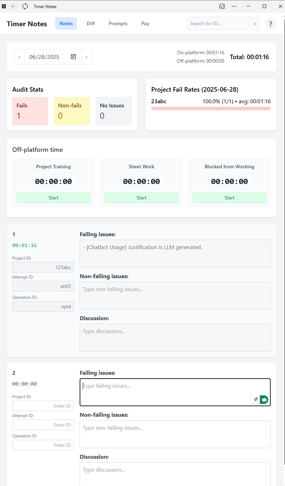

# Timer Notes

A web-based note-taking application with time tracking, text comparison, and system prompt generation features.


## Features

- **Time Tracking**: Track total time spent on task. The time starts once an ID or text is entered into a note.
- **Off-Platform Time Tracking**: Track time spent on activities outside the platform (training, sheetwork, blocked time)
- **Pay Analysis**: Weekly earnings report with detailed breakdowns of on-platform and off-platform time
- **Feedback**: Auto-format feedback with Ctrl-X
- **Writing Tool Integration**: Works with Quillbot and Grammarly for checking grammar and spelling
- **Text Diff Tool**: Compare two versions of text with a built-in diff viewer
- **Note Cancellation**: Press `F1` on any non-completed note mark the note as a canceled task and copy the cancellation message to the clipboard
- **System Prompt Generators**: Generate specialized prompts for code setup instructions and AI response evaluation


## Installation

1. Clone the repository:
```bash
git clone [your-repository-url]
cd [repository-name]
```

2. Start a local Python server:
```bash
python -m http.server 8000
```

3. **For Full-Screen Experience (Recommended)**:
   - Open Microsoft Edge and navigate to `http://localhost:8000`
   - Click the three dots menu (⋮) in the top-right corner
   - Select "Apps" → "Install this site as an app"
   - Launch the app from your Start menu or desktop for a distraction-free, full-screen experience

## Usage

1. **Notes View**:
   - Filter notes by date
   - View total time tracked
   - Access project fail rate information
   - Use Quillbot or Grammarly browser extensions for enhanced writing assistance

2. **Off-Platform Time Tracking**:
   - Features include:
     - Date-specific timers that maintain independent tracking for each day
     - Start/stop timers for each category
     - Edit timer values by hovering over the timer and clicking the edit icon
     - Sticky timer display that follows you as you scroll down the page
   - Track time spent on different activities outside the platform:
     - Project training
     - Sheetwork
     - Blocked from working

3. **Diff View** (Ctrl+D):
   - Paste original and modified text
   - Compare differences between texts

4. **Pay Analysis View** (Ctrl+Y):
   - Weekly earnings report with calendar selection
   - Detailed breakdown of time tracked
   - Summary statistics of time worked for the week

5. **System Prompt View** (Ctrl+P):
   - LLM prompt template formatter
   - Use Ctrl+X in the to copy the generated prompt
   - **Code Setup Prompt Generator**: 
     - Gives instructions on how to setup environment
     - Works with either the prompt or response with the code you want to run
   - **Prompt/Response Evaluation Generator**:
     - Evaluates a prompt and response pair
     - Covers code correctness, instruction following, efficiency, documentation, design, and explanation accuracy

## Keyboard Controls

### View Controls
- **Ctrl+D**: Switch to Diff view
- **Ctrl+P**: Switch to System Prompt view
- **Ctrl+Y**: Switch to Pay Analysis view

### Note Controls
- **Ctrl+Enter**: Finish current note and stop the timer
- **Ctrl+X**: Copy formatted feedback to clipboard (Notes view) or copy generated prompt (System Prompt view)
- **Ctrl+Shift+V**: Paste clipboard content as formatted bullet point `- [content]`
- **F1**: Cancel the current active note and copy cancellation message to clipboard

## Writing Tool Integration

Timer Notes is fully compatible with popular writing enhancement tools:
- **Quillbot**: Use for paraphrasing and grammar checking
- **Grammarly**: Get real-time writing suggestions and corrections

## Screenshot
